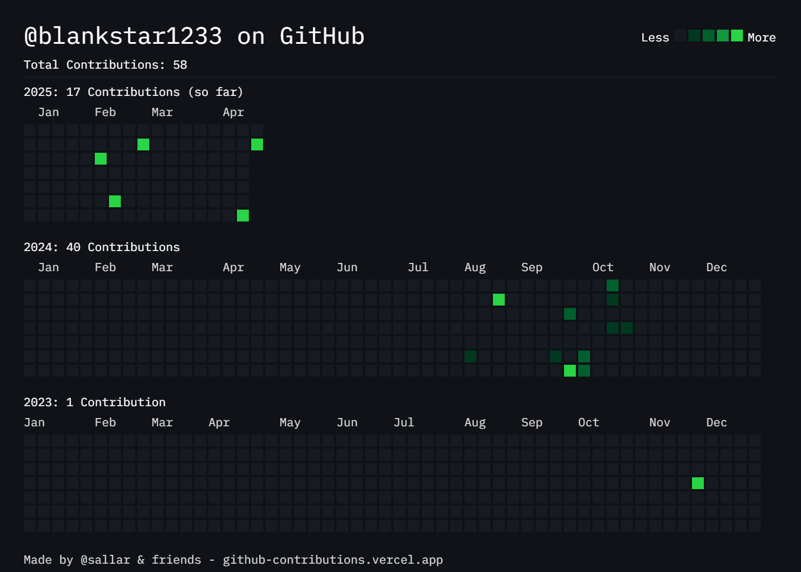

  

<h1 align="center">🚀 Welcome to My GitHub Dashboard</h1>

  

---

## 👋 Hi there, I'm Ved Vivek Joshi!

I'm passionate about building clean, responsive, and dynamic web applications and android applications. This repo showcases my **personal developer dashboard** – your one-stop glance into my world of code, tools I love, and articles I write.  

---

### 🛠️ Tech I Work With

  
  
  
  
  
  
  
  
  <!-- Add more badges as you like -->

---

### ✍️ Latest Blog Posts

<!-- BLOG-POST-LIST:START -->
- [Getting Started with Dashboards Using React](#)
- [How I Built My Personal Dashboard](#)
- [A Frontend Developer’s Guide to GitHub Profiles](#)
<!-- BLOG-POST-LIST:END -->

---

### 📈 GitHub Stats

### Pinned Repositories

Here are links to some of my pinned repositories:

* [PALCOA](https://github.com/Blankstar1233/Palcoa))
* [weather_app_flutter](https://github.com/Blankstar1233/weather_app_flutter)
* [Collabrify](https://github.com/Blankstar1233/Collabrify)

---

### 🧩 Current Project Highlight

> ✅ This dashboard is my personal developer home. It's dynamic, modular, and built to scale. I use it to test new UI ideas, track metrics, and share tech content.

---

### 🖼️ Screenshots

| Contribution data |
|--------------------
|  |

### Commit History

---

### 🙌 Let's Connect

  
  
  

---

> Built with ❤️ using [Markdown](https://www.markdownguide.org/), [Shields.io](https://shields.io), and GitHub stats APIs.
